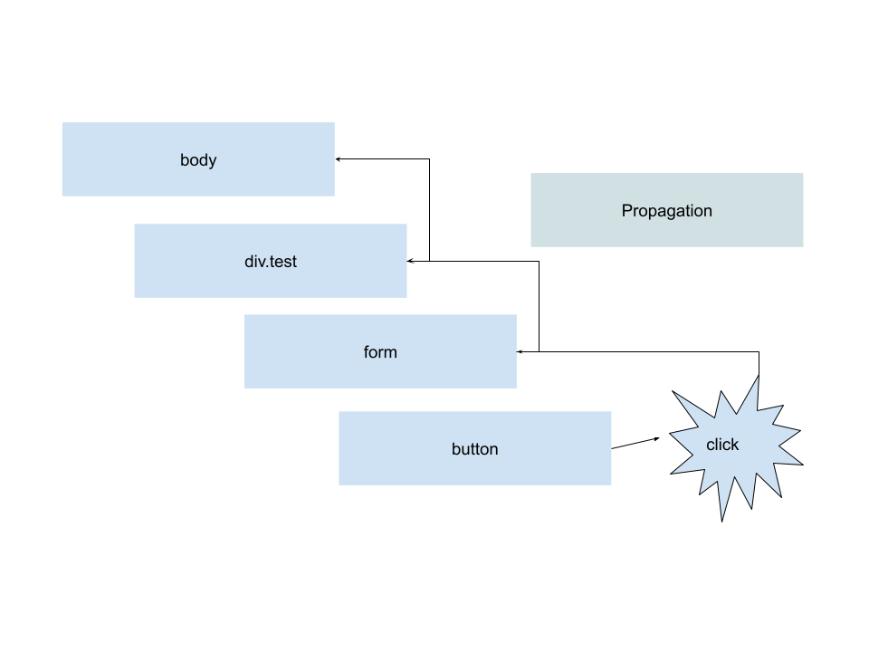

# DOM et les événements

Lorsqu'un utilisateur réalise des actions sur la page (clique, scroll, bouger la souris, appuyer sur le clavier ...) le DOM déclenche un événement !

Un événement c'est tout d'abord un type ('click', 'dbclick', 'keypress', etc ...) qui décrie l'action que vient de réaliser l'utilisateur. En plus d'un type c'est aussi une **fonction**, cette dernière est lancé lorsque l'événement se produit.

Vous pouvez retrouvez la liste de tout les types d'événement juste ici :

[Liste des types d'évenements](https://developer.mozilla.org/fr/docs/Web/API/Event)

## Attacher des événements

Pour attacher un événement il faut tout d'abord récupérer le `Document` ou bien un `DOMElement` ensuite il faut appeler la fonction `element.addEventListener`.

Cette fonction accépte 2 paramètres :

- Le type d'événement listé plus haut (ex: 'click', 'dbclick' etc ...)
- La fonction qui se déclenchera lors de l'événement

```js
// Je récupére le bouton avec la class "super-bouton"
const button = document.querySelector('.super-button')

// J'ajoute un événement lors du clique !
button.addEventListener('click', () => {
  console.log('Click sur le bouton !!')
})
```

Il est conseillé de placer les fonctions d'événement dans les propres fonctions (soit fléché, soit compilé) :

```js
// Je récupére le bouton avec la class "super-bouton"
const button = document.querySelector('.super-button')

// Créer une fonction d'événement
function onButtonClick() {
  console.log('click sur le bouton !')
}

// Créer une deuxième fonction d'événement
const onButtonMouseEnter = () => console.log('Entré de la souris !')

// J'ajoute un événement lors du clique !
button.addEventListener('click', onButtonClick)
button.addEventListener('mouseenter', onButtonMouseEnter)
```

Il est aussi possible dans certains de supprimer tout les événement d'un type données :

```js
// On enléve la fonction "onButtonClick" sur l'évenement click
button.removeEventListener('click', onButtonClick)
// On enléve la fonction "onButtonMouseEnter" lors de l'événement
// mouseenter
button.removeEventListener('mouseenter', onButtonMouseEnrer)
```

## L'objet « `Event` »

Lorsqu'un événement se produit (un 'click', un 'dblclick' ...) la fonction se déclenchant reçoit un paramètre : un objet `Event`.

Cet objet contient de nombreuse information sur ce qui vient de se produire à l'écran !

```js
// Je séléctionne un div
const div = document.querySelector('.game')

// On créer un événement se déclenchant dès que la souris
// bouge dans la div
function onMouseMove(event) {
  // Cette objet event, contient les coordonnées de la souris !
  event.pageX // coordonnée X (abscice)
  event.pageY // corrdonnée Y (ordonné)DD

  // Je peux aussi récupérer l'élément html qui a produit l'événement :
  event.target // Je récupére le DOMElement de div.game

  // Je peux récupérer la touche du clavier !
  event.code // Code générique correspondant à la position de la touche par rapport à une clavier qwerty
  event.key // La vértiable lettre préssé par l'utilisateur
  event.ctrlKey // boolean, vrai si la touche controle est appuyé, faux sinon
  event.altKey // boolean, vrai si la touche alt est appuyé, faux sinon
  event.shiftKey // boolean, vrai si la touche shift est appuyé, faux sinon
}

// J'attache mon événement à la div
div.addEventListener('mousemove', ouMouseMove)
```

### Prévenir le comportement par défaut

Votre navigateur possède déja des événements « préfabriquer » (ex: lors du clique d'un lien, la navigateur me redirige vers le lien ...), on dit que ce son « les comportements par défaut ».

Nous pouvons « éliminer » ou « désactiver » ces comportement, en utilisant l'objet event et la fonction `event.preventDefault()` :

```js
// Je séléctionne un a
const a = document.querySelector('a.first-link')

// On créer un événement se déclenchant dès que la souris
// bouge dans la div
function onClick(event) {
  // Je désactive le comportement par défaut
  // c'est à dire que le navigateur ne faira rien lors du clique
  event.preventDefault()
}

// J'attache mon événement à la div
a.addEventListener('click', onClick)
```

### La propagation

Lorsque l'on produit un événement sur un element, les element parents sont aussi concerné !



C'est que l'on appel la **propagation**.

Il est aussi de stopper cette propagation, de faire en sorte de briser la chaîne. L'évenement ne se répercutera plus sur ses parents :

```js
// Je séléctionne un a
const submit = document.querySelector('form button.submit')

// On créer un événement se déclenchant dès que la souris
// bouge dans la div
function onClick(event) {
  // Je désactive la propagation, c'est à dire que l'événement
  // ne se propagera plus à ses parents !
  event.stopPropagation()
}

// J'attache mon événement à la div
submit.addEventListener('click', onClick)
```
