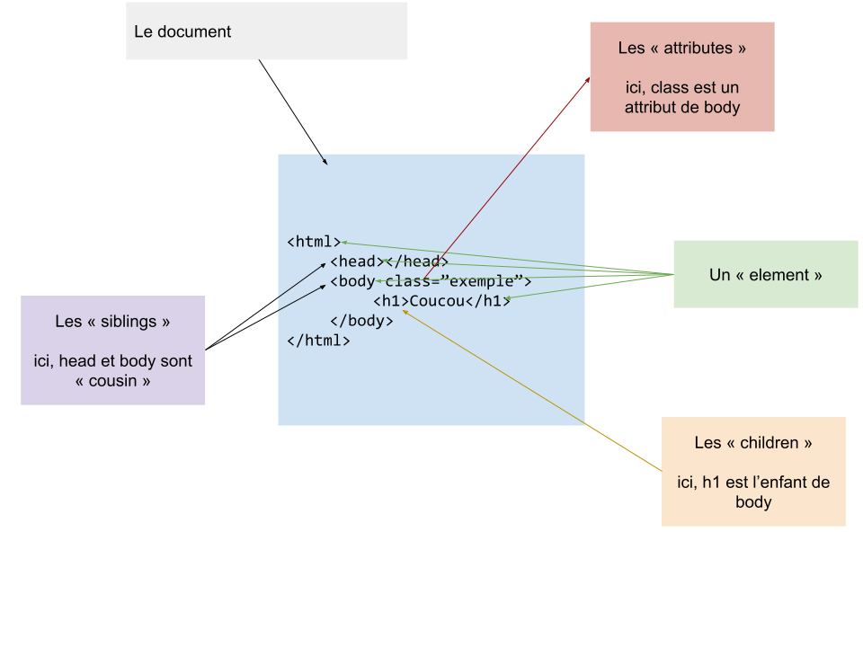

# Le DOM (Document Object Modeling)

Le DOM est une série d'object, functions et autres javascript diréctement installé sur le navigateur permettant d'interargir avec une page HTML (voir même l'intégralité de votre navigateur).

Le DOM est basé sur un système de « binary tree » (arbres binaires). Il utilise sont propre vocabulaire afin de représenter une page HTML :



## Comment ça marche ?

Pour utiliser il faut être sur une page HTML (exemple, le DOM n'éxiste pas en **nodejs** ou sur un **téléphone mobile**).

Maintenant nous pouvons dans cette page utiliser une balise `<script>` afin de commencer à utiliser le DOM :

```html
<!-- index.html -->
<html>
  <head>
    <title>Ma page</title>
  </head>
  <body>
    <h1>Ma Page</h1>
    <!-- ici on ajout notre javascript : -->
    <script>
      console.log('javascript')
    </script>
    <!-- On peut aussi attacher un fichier javascript -->
    <script src="./monfichier.js">
  </body>
</html>
```

```js
// monfichier.js
console.log('mon fichier javascript')

// Dans mon fichier.js, j'ai accès à ce fameux document !
// étant que c'est une balise script, le document est accessible
// n'importe ou !
console.log(document)
```

## Le « document »

Le navigateur met à disposition un objet très puissant permettant de **tout faire** sur votre page (clicker, modifier, animé ...) ! C'est le [`document`](https://developer.mozilla.org/fr/docs/Web/API/Documenthttps://developer.mozilla.org/fr/docs/Web/API/Document)
