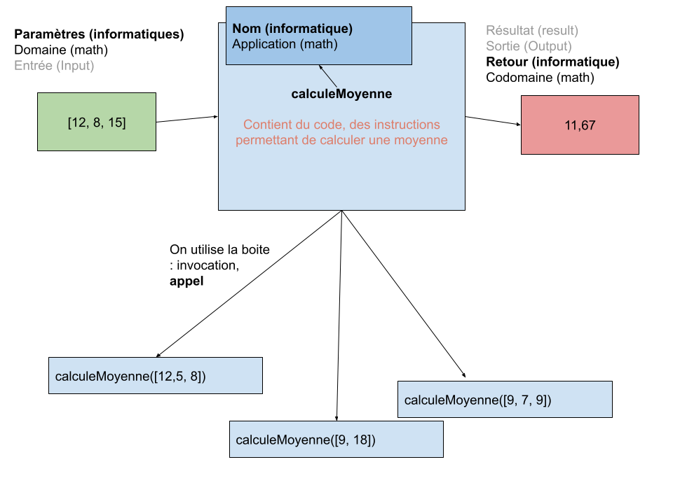
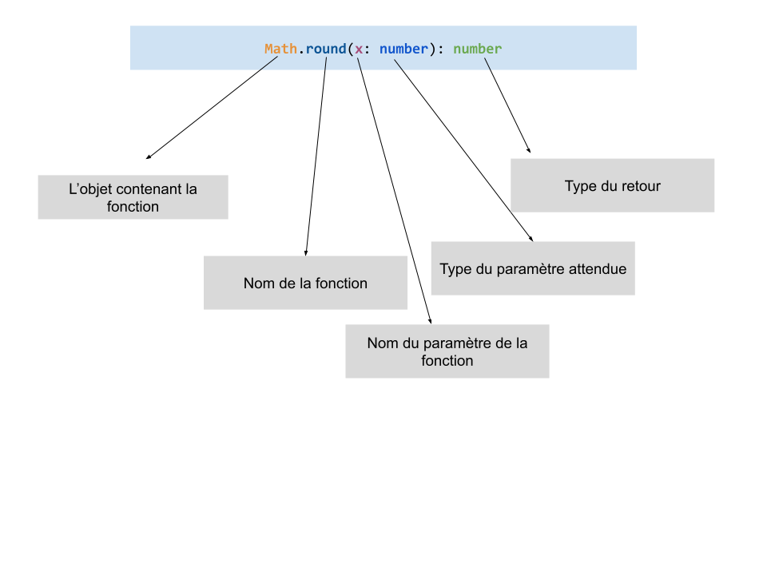

# Les fonctions

Une fonction est une boite nommé contenant du code réutilisable. Elles reçoivent des **paramètres** et sorte un **retour** :



## L'appel de fonction

En javascript, il existe de très nombreuse « boîte » contenant du code et permettant de lancer des milliers d'opérations différente. On appel ces boîtes les **fonctions standard**.

Ces dernières sont extrêmement nombreuse, cependant elles sont rangé dans certains objets. Étant donné qu'en javascript **tout est objet**, tout ce que l'on manipule possède des fonctions ! Du boolean, à la chaînes de caractères, ces **objets** possèdent leurs propres fonctions !

Dans ce supports nous découvrirons les fonctions les plus répandue, ien sur il existe tout un tas de fonctions que l'on peut retrouver dans la documentation officiel de javascript : [La MDN](https://developer.mozilla.org/en-US/docs/Web/JavaScript)

### Les fonctions de « casting »

Ces fonctions permettent de transformer un valeur d'un type données (string) dans un autre type (number) :

#### `parseInt`

[`parseInt`](https://developer.mozilla.org/en-US/docs/Web/JavaScript/Reference/Global_Objects/parseInt) permet de transformer un chaîne de caractère en number (en nombre entier) :

```js
parseInt('10', 10) // number 10
parseInt('10.34', 10) // number 10
parseInt('abcd', 10) // NaN
```

#### `parseFloat`

[`parseFloat`](https://developer.mozilla.org/en-US/docs/Web/JavaScript/Reference/Global_Objects/parseFloat) permet de transformer une chaîne de caractère en number (en nombre à virgule) :

```js
parseFloat('10') // number 10
parseFloat('10.453') // number 10.453
```

#### `.toString()`

`.toString`, cette fonction est présente dans **tout les types** (sur toutes les données). Elle permet de transformer un type donnée en string :

```js
10.toString() // '10'
true.toString() // 'true'
```

> La fonction toString, est ce que l'on appel une « méthode ». C'est dire que plutôt que de prendre un paramètre elle s'applique directement sur un objet (string, boolean, number etc ...)

### Les fonctions mathématique

Ces fonctions sont utilisé pour faire des calcules, elles sont rangé dans un objet [`Math`](https://developer.mozilla.org/en-US/docs/Web/JavaScript/Reference/Global_Objects/Math) :

```js
// On peut arrondir un nombre à l'entier le plus proche
Math.round(10.23) // 10
Math.round(10.68) // 11

// On peut aussi arrondir à l'entier le plus bas
Math.floor(10.23) // 10
Math.floor(10.68) // 10

// On peu aussi arrondir à l'entier le plus haut
Math.ceil(10.23) // 11
Math.ceil(10.68) // 11

// On peut générer un nombre aléatoire à virgule entre 0 et 1
Math.random() // 0.545615
Math.random() // 0.1215165
```

### Les fonctions de la `console`

Il est possible d'utiliser l'objet [`console`](https://developer.mozilla.org/en-US/docs/Web/API/console) pour afficher des choses dans le console de développement de votre navigateur :

```js
// On peut afficher un message dans la console
console.log('Coucou') // Affiche dans le console 'Coucou'

console.warn('Coucou') // Affiche dans la console un warning 'Coucou'

console.error('Coucou') // Affiche dans la console une erreur 'Coucou'

console.table([12, 1, 5]) // Affiche des tableaux de manière « jolie »

console.table({ firstname: 'John', lastname: 'Doe' }) // Affiche un objet de manière « jolie »
```

Nous venons de voir les fonction les plus élémentaire.

## Comprendre une signature

Chaque fonctions possèdent une **signature** : C'est le mode d'emploie d'une fonctions. La signature permet du premier coup d'oeil de connaître ses paramètre et son retour :



## Manipuler le retour

Voici un exemple un peu plus complet d'utilisation de fonctions et de leurs retours :

```js
const notes = [12.5, 8.25, 9.75, 18.25]

for (let note of notes) {
  console.log(`La note arrondie est ${Math.round(note)}`)
}

for (let index in notes) {
  const position = index + 1
  const note = notes[index]
  const roundedNote = Math.round(note)

  console.log(`La note n°${position} est ${note} (soit ${roundedNote})`)
}
```

## Créer ses propres fonctions

Lorsque l'on écrit un programme, il est toujours des opérations que l'on répété un tas de fois (comme dérouler un menu, jouer de la musique, calculer moyenne etc ...).

Ces opérations qui sont redondante (on les rencontres plusieurs fois dans notre code) peuvent être placé dans une fonction pour pouvoir être réutilisé.

Pour cela il est tout à fait possible de créer nos propre fonctions !

### Les fonctions « compilé »

Ce sont les fonctions les plus classique, facile à écrire et à comprendre c'est la façon recommandé de créer des fonctions.

On utilise le mot `function` suivie du nom de notre fonction, on spécifie des paramètres et un block de code nous permettant de placer les instructions de la fonction :

```js
// Création d'une fonction permettant d'additionner
// deux nombre
function additionner(x, y) {
  const resultat = x + y

  return resultat
}

// Additionner 10 et 5
const x = additionner(10, 5)

console.log(x) // 15
```

#### Les paramètres par défaut

Certaines fonctions possèdent des paramètres par défaut. Ils sont facultatif, si il ne sont pas présent lors de l'appel alors la valeur par défaut est utilisé :

```js
// Création d'une fonction permettant d'additionner
// deux nombre
function additionner(x, y = 5) {
  const resultat = x + y

  return resultat
}

const x = additionner(10) // x = 15
const y = additionner(5) // x = 10
const z = additionner(5, 15) // x = 20

console.log(x) // 15
```

> Les paramètres par défaut sont toujours **les derniers paramètres**

```js
// Les paramètres par défaut sont toujours les derniers
function additionner(x = 5, y) {
  // Erreur !!!!
  const resultat = x + y

  return resultat
}

// Nous avons un problème lors de l'appel
const x = additionner(10) // x = 15
const y = additionner(5) // x = 10
const z = additionner(5, 15) // x = 20

console.log(x) // 15
```

#### Les paramètres infinie (le « spread operator ») :

Il existe de fonctions qui peuvent prendre un nombre infinie de paramètres. Pour cela nous pouvons utiliser le « spread operator » (`...`) afin de déclarer des paramètres infinie :

```js
/**
 * Fonction qui additionne 1 ou Infinie de paramètres entre eux.
 *
 * Pour cela on utilise le spread operator : ...
 */
function additionner(...listNumbers) {
  // La paramètre listNumbers est un tableaux (list/array) contenant
  // tout les paramètre passé lors de l'appel de la fonction
  let total = 0

  for (let n of listNumbers) {
    total = total + n
  }

  return total
}

const x = additionner(1, 2) // 3
const y = additionner(10, 5, 5) // 20
const z = additionner(10, 10, 5, 5, 20) // 50
```

#### Les fonctions et les objets

Il est possible d'envoyer à une fonction un objet. C'est même très répandu. Nous pouvons recevoir et traiter cette objet :

```js
function additionnerNoteEleve(eleve) {
  let total = 0

  for (let n of eleve.notes) {
    total = total + n
  }

  return total
}

const john = {
  nom: 'Doe',
  prenom: 'JOhn',
  age: 24,
  notes: [12, 5, 3, 18],
}

const totalNotes = additionnerNoteEleve(john) // 38
```

Les fonctions recevant des objets sont souvent plus difficile à comprendre. Si nous lisons la première ligne de déclaration de la fonction :

```
function additionnerNoteEleve(eleve) {
```

Nous n'avons aucune indication sur ce que peut possiblement contenir un élève ... On est obligé de lire le contenu de la fonction pour comprendre ce que contient l'eleve ce qui peut s'avérer fastidieux.

Pour rendre cette fonction plus claire et facile à comprendre on utilise la destructuration :

```js
/**
 * Ici on recoit toujours un eleve, mais que l'on vas destructurer afin de prendre
 * uniquement la données nescessaire au bon fonctionnement de la
 * fonction
 */
function additionnerNoteEleve({ notes }) {
  let total = 0

  for (let n of notes) {
    total = total + n
  }

  return total
}

const john = {
  nom: 'Doe',
  prenom: 'John',
  age: 24,
  notes: [12, 5, 3, 18],
}

const rose = {
  nom: 'Doe',
  prenom: 'Rose',
  age: 24,
  notes: [12, 5, 10],
}

const totalNotes = additionnerNoteEleve(john) // 38
const totalNotes = additionnerNoteEleve(rose) //
```

Grâce à cette technique je peut lire uniquement la première ligne de la fonction :

```
function additionner({ notes }) {
```

Ici je vois plus clair sur l'objet à envoyer.

## Les fonctions fléchés

Il existe un autre façon de faire les fonctions, plus moderne (inventé en 2005) plus conscice et surtout très pratique !

Cette autre façon de faire se nomme les « fonction fléchés », elles sont utilisé à des fins de traitement de la données.

Concrètement, la syntax change mais les concept et le fonctionnement reste identique :

```js
/**
 * Une fonction compilé qui accepte 2 parmètres x et y et
 * qui retourne le résultat de son addition
 */
function additionner(x, y) {
  const resultat = x + y

  return resultat
}

/**
 * Voici un syntax alternative et plus conscise : la fonction fléché.
 *
 * Une fonction s'assigne dans une variable
 */
const additionner2 = (x, y) => {
  const resultat = x + y

  return resultat
}

/**
 * Nous pouvons simplifier notre fonction, car la constante resultat n'est
 * nécessaire
 */
const additionner3 = (x, y) => {
  return x + y
}

/**
 * Lorsqu'une fonction fléché ne possède qu'une seule instruction et que
 * c'est une return, alors nous pouvons enlever le return et enlever
 * les accolades :
 */
const additionner4 = (x, y) => x + y

// Les deux fonctions s'utilise le même manière
const x = additionner(1, 2) // 3
const y = additionner2(1, 2) // 3
const z = additionner3(1, 2) // 3
const w = additionner4(1, 3) // 3
```

l’objectif de ces fonctions c'est d'être plus courte à écrire et lire, ce qui nous sera très pratique lors du traitement de certaines données.

> Si possible, il est conseiller de toujours déclarer des **fonction compilé**, les fonctions fléché sont généralement réservé à une utilisation sur les **callbacks**

## Les fonctions sur les tableaux (boucles fonctionnelle)

En javascript, nous utilisons rarement les boucles `for in`, `for of` et `while`. La forme la plus populaire pour boucler reste les opérations fonctionnelle sur les tableaux.

Ces opérations sont au nombre de 5 :

- `forEach` : Boucle sur tout les éléments du tableaux mais ne modifie pas le tableaux original et retourne strictement le même tableaux qu'a l'origine
- `map` : Boucle sur tout les éléments du tableaux, ne modifie pas le tableaux original mais retourne un tout nouveaux à partir de l'original
- `filter` : Boucle sur tout les éléments du tableaux, ne modifie pas le tableaux original et retourne un nouveau tableaux « filtré »
- `sort` : Boucle sur les éléments du tableaux, ne modifie pas le tableaux original et retourne un nouveau tableaux « trié »
- `reduce` : Boucle sur les éléments du tableaux, no modifie pas le tableaux original, retourne un autre type que le tableaux

### Le forEach

Le forEach est une fonction accessible sur tout les tableaux en javascript. Pour fonctionner, cette fonction accépte en paramètre ... Une autre fonction ...

Cette autre fonction est nommé **callback**, elle recoit en paramètre chaque élément du tableaux, son index, le tableaux original. Nous pouvons placer le code que nous souhaitons dans cette fonction sans altérer le tableaux original !

On dit que l'on boucle sur un tableaux de manière sécurisé (aucune modification n'est possible) c'est **l'immutabilité**

```js
const notes = [12, 8, 9, 16, 14]

notes.forEach((note, index, notesOriginal) => {
  console.log(`La note n°${index + 1} est ${note}`)
  console.log(notesOriginal) // [12, 8, 9, 16, 14]
})

// La forme la plus répandu
notes.forEach((note, index) => {
  console.log(`La note n°${index + 1} est ${note}`)
})
```

### Le map

Très similaire au forEach à la différence qu'elle retourne un tout nouveau tableaux, ce tout nouveau est construit en exécutant une fonction sur chaque élément du tableaux original :

```js
const notes = [12, 8, 9, 16, 14]

// La plus contracté
const nouvelleNotes = notes.map(note => note + 1)
// const nouvelleNotes = notes.map((note) => note + 1)
// const nouvelleNotes = notes.map((note) => {
//    return note + 1
// })

console.log(notes) // [12, 8, 9, 16, 14]
console.log(nouvelleNotes) // [13, 9, 10, 17, 15]
```

### Le filter

Très similaire au map, reçois les même paramètres, sauf que la fonction de traitement (la callback) doit retourner un boolean. Si ce boolean est vrai l’élément est conserver si faux l'élément disparais :

```js
const notes = [12, 8, 9, 16, 14]

const nouvelleNotes = notes.filter(note => note >= 10)

console.log(notes) // [12, 8, 9, 16, 14]
console.log(nouvelleNotes) // [12, 16, 14]
```

### Le sort

Très similaire au filter, la callback reçoit 2 notes, retourne un entier :

- `-1` : Met la valeur avant
- `1` : Met la valeur après
- `0` : Ne bouge pas la valeur

```js
const notes = [12, 8, 9, 16, 14]

// Ici la callback de sort reçois un couple de note :
const nouvelleNotes = notes.sort((note1, note2) => {
  if (note1 > note 2) {
    return 0
  } else {
    return -1
  }
})

console.log(notes) // [12, 8, 9, 16, 14]
console.log(nouvelleNotes) // [16, 14, 12, 9, 8]
```

### Le reduce

Le reduce est probablement la fonction de traitement la plus puissante des 5, elle permet de passer d'un tableaux à n'importe quoi d'autre (string, number etc ...).

reduce accépte une callback en premier paramètre et un accumulateur en second paramètre.

La callback est une fonciton qui accépte dans l'ordre :

- L'accumulateur
- La valeur en cours
- L'index
- Le tableaux original

L'objectif est que grâce à l'accumulateur nous pouvons modifier un tableaux en n'importe quelle autre type :

```js
const notes = [12, 8, 9, 16, 14]

// Ici la callback de sort reçois un couple de note :
const sentence = notes.reduce((acc, note) => {
  return acc === '' ? `${note}/20` : `${acc}, ${note}/20`
}, '')

console.log(notes) // [12, 8, 9, 16, 14]
console.log(sentence) // "12/20, 8/20, 9/20, 16/20, 14/20"
```
