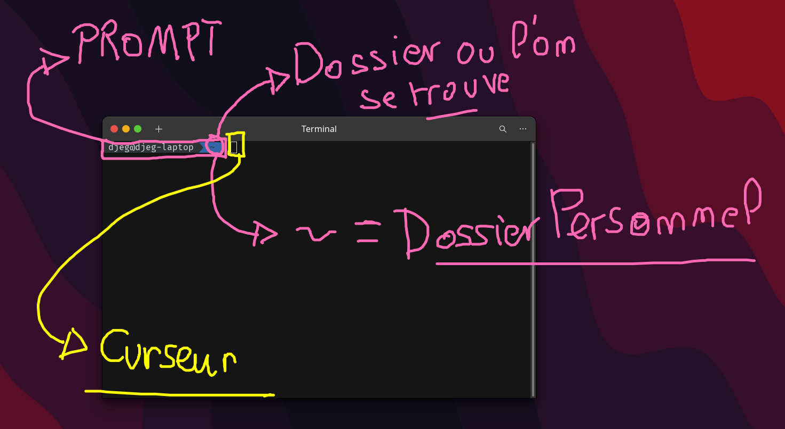

# Le Terminal

Le terminal c'est « l'ancêtre » de tout les systèmes d'exploitation d'aujourd'hui (windows, mac, linux ... tout ces systèmes peuvent être utilisé avec le terminal). C'est l'ancienne façon d'utiliser un ordinateur.

En tant que développeur nous allons utilisés des outils uniquement disponible sur le terminal. Non ps que les développeurs soit tous feignant, mais parce que le terminal est plus radide, léger, moins gourmand, plus puissant, plus complet on peut plus de choses.

## Les familles

Tout les terminaux ne s'utilise pas de la même manière, il éxiste, comme avec les systèmes d'exploitation 2 grandes familles :


> Dans ce cours il est fortemant d'installer [Git Bash](https://github.com/git-for-windows/git/releases/download/v2.39.1.windows.1/Git-2.39.1-64-bit.exe) pour les utilisateurs windows

## Le Prompt et les commandes

Un « shell » est constitué d'un prompt et d'un curseur pour rentrer des commandes :



> **Tout les prompts sont différent**, certains affiche le dossier, d'autre rien du tout, d'autre uniquement le nom d'utilisateur etc ....

## Les commandes

Un « shell » c'est tout d'abord comme un explorateur de fichier. Il s'ouvre dans un dossier de votre ordinateur (`~` signifie « dossier personelle »).

Il est possible à l'aide de commande de se déplacer, lister et aussi afficher les dossier et fichier ...

### `pwd`

Cette commande (`Print Working Directory`) affiche le chemin complet du dossier dans lequel votre terminal est ouvert.

```bash
$ pwd
/home/Djeg
```

> Chaque dossier est séparé par `/` !
> Sur windows le dossier principal (on appel ça la racine de l'ordinateur) est `/c` alors que mac, linux c'est `/`

Cette commande est utilisé pour connaître notre position, souvent on se perd sur notre ordinateur. N'hésitez pas à utiliser `pwd` pour vous réorienté.

### `ls`

Cette commande (`LiSt`) liste tout les dossier et fichier présent dans le dossier en cours.

```bash
$ ls
Dossier1 Dossier2 mon-fichier.html
```

> Certaines accépte des options. Elles peuvent courte ou longue. Pour les options courte c'est `-` suivie d'une lettre `-l`. Pour les options longues c'est `--` suivie du nom de l'option `--help`

> Essayer d'utiliser `ls` avec les options courtes : `lah`

### `cd`

Cette commande (`Change Directory`) permet de se déplacer dans notre ordinateur ! C'est probablement la plus importante de tous. Cette commande pour fonctionner accèpte un **argument**. L'argument est une donnée que l'on envoie à la suite de notre commande.

Pour se déplacer de dossier en dossier il suffit de spécifier en argument le nom du dossier dans lequel on vous se déplacer :

```bash
$ cd NomDossier
```

> Attention, le « NomDossier » doit éxisté sur l'ordinateur et aussi dans le dossier dans lequel vous vous situé !

Il est aussi possible de revenir en arrière en utilisant l'argument `..` :

```bash
$ cd ..
```

> La commande `cd` c'est comme ci on réaliser un double clique dans un dossier

Il est aussi possible de se déplacer de plusieurs dossier à la fois en séparant par un `/`

```bash
$ cd Dossier1/SousDossier
```

Il en vas de même pour le retour en arrière :

```bash
# On réalise 3 retour en arrière !
$ cd ../../..
```

#### `tab` à la rescousse !

Généralement il est plutôt très fastidieux d'écrire à la main le nom des dossier ou l'on veut se rendre. Il éxiste un « magicien » c'est la touche `tab` !

Elle permet d'auto complété le nom du dossier tout seul.

> Commencer à taper `cd Do` puis `tab`, votre shell trouvera tout seul le nom du dossier commencant par `Do`

### `clear`

Il arrive parfois que nous ayons trop de choses d'afficher dans notre terminal. Pour effacer le contenue du terminal, on utilise la commande `clear`

```bash
$ clear
```

### `mkdir`

Cette commande (`MaKe DIRectory`) permet de créer un nouveau dossier :

```bash
$ mkdir monDossier
```

### `rmdir`

Cette commande (`ReMove DIRectory`) permet de supprimer un dossier

> **LE SHELL NE PASSE PAR LA CORBEILLE !!!!! TOUTE SUPPRESSION EST DEFINITIF !!**

> **LE DOSSIER DOIT ÊTRE VIDE !!**

```bash
$ rmdir nomDuDossier
```

### `touch`

Cette commande (`touch`) permet de créer un nouveau fichier vide.

```bash
$ touch monfichier.txt
```

### `rm`

Cette commande (`ReMove`) permet de supprimer un fichier.

```bash
$ rm monfichier.txt
```

> **LE SHELL NE PASSE PAR LA CORBEILLE !!!!! TOUTE SUPPRESSION EST DEFINITIF !!**

De base, rm ne supprime pas les dossiers. Cependant il éxiste l'option courte `r` (`recursive`) permettant de supprimer un dossier. On peut associer cette option avec l'option courte `f` (`force`) pour enlever toutes confirmation.

> C'est la commande la plus dangereuse de votre système !!

```bash
$ rm -rf monDossier
```

> **À UTILISER AVEC BEAUCOUP DE PRÉCAUTION**

### `cp`

La commande `cp` (`CoPy`) permet de copier coller, elle accepte 2 argument, le nom fichier à copier et la destination :

```bash
$ touch monfichier
$ cp monfichier copyDeMonFichier
```

> De base, `cp` marche uniquement avec les fichier, pas avec les dossier. Il faut utiliser l'option courte `r` pour copier coller un dossier

### `mv`

Le commande `mv` (`MOve`) permet de couper / coller (on dit qu'il déplace le fichier), comme `cp`, `mv` accépte 2 arguments :

```bash
$ touch monfichier
$ mv monfichier monFichier
```

> Tout comment `cp`, marche uniquement avec les fichier mais on peut rajouter l'option `r` pour les dossier.

## Bonus : Manipuler VSCode !

Dans votre terminal vous pouvez manipuler VSCode ! Vous pouvez ouvrir VSCode grâce au terminal :

```bash
$ code nomFichier
```

Ici vscode accépte un fichier ou même dossier ! Il est aussi possible d'ouvrir le dossier dans lequel on se situe avec le terminal :

```bash
$ code .
```

> Sur certain système, la commande `code` prend un majuscule : `Code`

## Pour aller plus loin

- Vous avez énormément de tuto sur internet vous apprennant la maitrise de terminal :
- - https://openclassrooms.com/fr/courses/7170491-initiez-vous-a-linux
- - https://openclassrooms.com/fr/courses/6173491-apprenez-a-utiliser-la-ligne-de-commande-dans-un-terminal

- Il éxiste un superbe chaîne youtube : https://www.youtube.com/@NetworkChuck

- Il est même possible de virtualiser des systèmes d'exploitation (c'est à dire d'avoir linux sur windows, ou android sur mac, windows sur linux etc ...)
- - https://www.docker.com/
- - https://grafikart.fr/tutoriels/docker-intro-634
- - https://grafikart.fr/tutoriels/dockerfile-636
