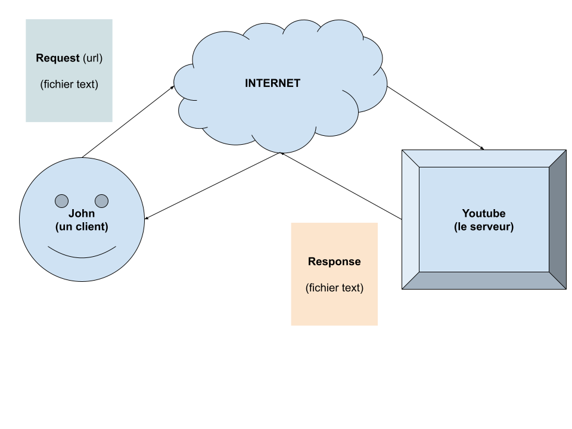

# Le Web : Protocole HTTP(S)

Il est possible en javascript et sur un navigateur de « se connécter » ç d'autre sites internets (applications web). Par exemple sur votre site de streaming favorie, il y a de fortes chance que les videos que vous visionné proviennent de plein d'endroit différents !

Pour se « se connécter » d'autre sites internets (applications web) il faut connaître le **web** (**protocole HTTP**).

## C'est quoi un protocole ?

Deux ordinateurs, c'est comme deux humains. Pour communiquer ils doivent partager la même langue. En informatique cette langue est ce qu'on appel **un protocole**

Des protocoles en informatique il en éxiste énormément :

- **`TCP / IP`** : C'est la base des touts les protocole suivant. On parle de **bas niveaux**. Ce qui est bas niveaux est très proche de la machine (du binaire), alors ce qui est haut niveaux c'est beaucoup plus proche d'un langage humain.
- **`UDP`** : C'est une autre base spécialement utilisé pour du temps réel, c'est le cas des jeux videos en ligne etc ... Il est beaucoup moins sécurisé.
- **`HTTP`** : Cest la langue utilisé pour les sites internets. Aujourd'hui c'est 98,5 % du trafic mondial, c'est la langue la plus utilisé pour communiquer des informations !
- **`HTTPS`** : C'est comme http mais en crypté !
- **`FTP`** : C'est une langue utilisé pour transférer des fichiers.
- **`SMTP`** : C'est la langue utilisé pour les email(s).
- **`IRC`** : C'est la langue utilisé pour des messageries instantanés. C'est un protocole plus beaucoup utilisé :/

## Comment qu'on fais pour parler à Sarah ?

Pour pouvoir communiquer, chaqu'un se voit attribué une **URL**. C'est la base de toute communication ! Cette **URL** (Unifier Resource Location) est divisé en plusieurs partie ayant toutes un sens données :

## Comment elle fonctionne la langue ?

Le protocole HTTP, (la langue du **web**) est basé sur des URL (utilisé aussi par tout les protocoles du monde). Le principe est simple, John (le client) envoie une demande (Request) et Sarah (le Serveur) retourne une réponse (Response). La request ou la response se sont de simple fichier text :

## C'est quoi la **Request** ?

La request est un fichier composé de plusieurs distinct :

Dans ces parties on retrouve :

### La méthode HTTP

C'est l'action que l'on souhaite éfféctuer sur une url :

- GET : Obtenir
- POST : Créer
- PUT / PATCH : Modifier
- DELETE : Supprimer

### Les en-tête HTTP

Ce sont des informations transmisent entre le client et le serveur (à votre insue). Il en éxiste énormément :

[Liste des en-tête http](https://en.wikipedia.org/wiki/List_of_HTTP_header_fields)

Chaque en-tête correspond à une information différente. Le plus célébre et utilisé c'est le `Content-Type` qui définie le type de contenu que nous souhaitons envoyé (`text/html`, `image/png`, `video/mp4`, [la liste compléte](https://en.wikipedia.org/wiki/Media_type) ...)

### Le body

Il est facultatif, il contient les données que vous souhaitez envoyer au serveur.

## C'est quoi la **Response** ?

C'est un fichier text contenant les informations de la réponse du serveur :

Parmis les informations de la réponse :

### La version de HTTP

Contient la version de HTTP utilisé par le serveur.

### Le status code

C'est un code ainsi qu'un text indiquant si tout c'est passé ou pas.

Il en existe un bon nombre :

[Liste des status code HTTP](https://en.wikipedia.org/wiki/List_of_HTTP_status_codes)

C'est code de status sont rangé en 5 catégrories :

- Les codes `1XX` : Ce sont des codes d'informations (très très rare)
- Les codes `2XX` : Ce sont des codes de succées
- Les codes `3XX` : Ce sont des codes de rediréction
- Les codes `4XX` : Ce sont des codes d'erreur de la part du client.
- les codes `5XX` : Ce sont des codes d'erreur du serveur (c'est ceux que l'on veut abslument éviter)
