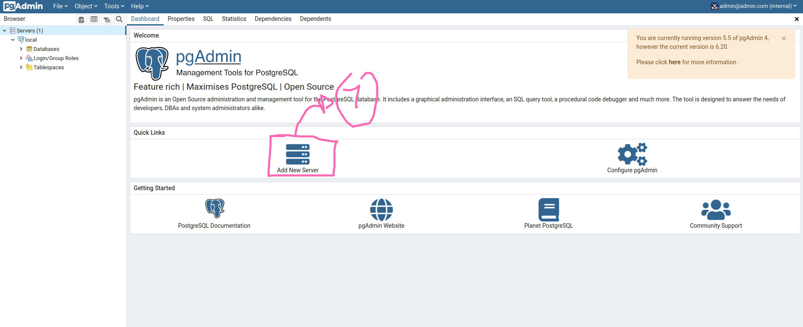
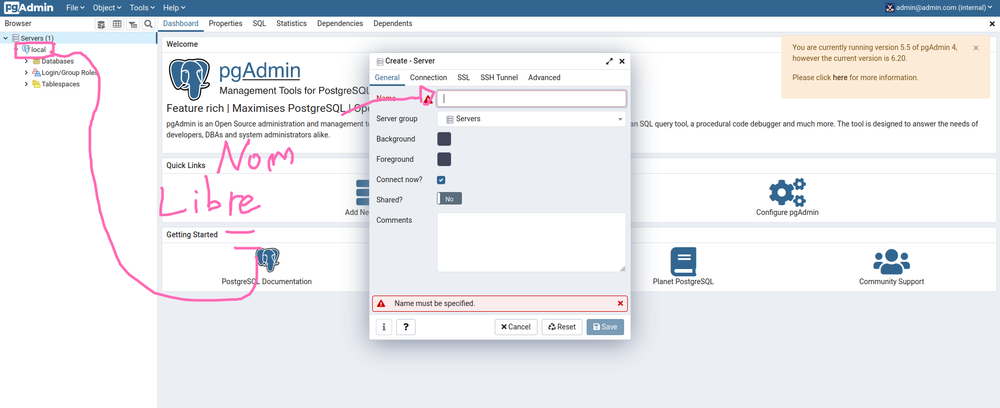
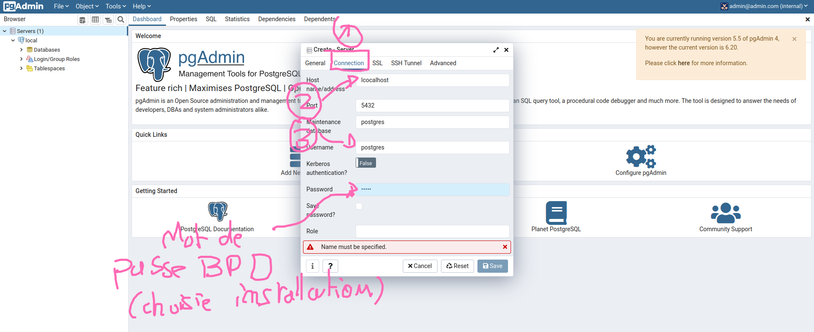
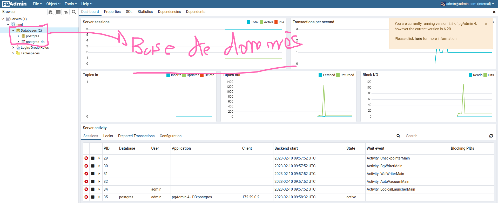
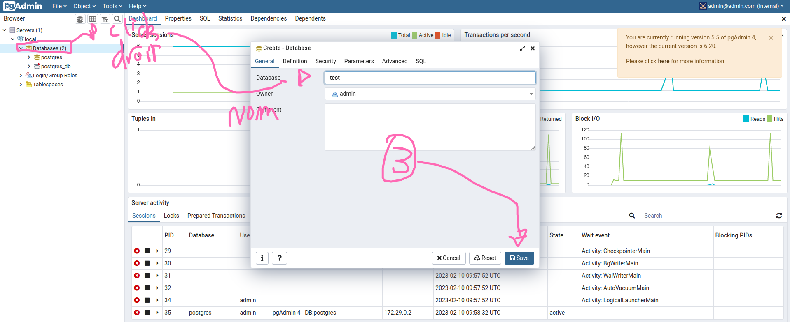
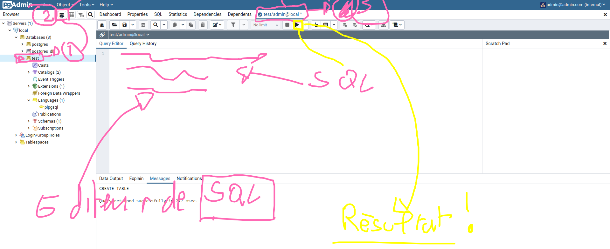

# PostGresSQL

PostGResSQL est une base de données relationel de plus en plus populaire.

## Installation

- Windows : https://sbp.enterprisedb.com/getfile.jsp?fileid=1258323
- Ubuntu : https://www.postgresql.org/download/linux/ubuntu/

## Pgadmin

Vous pouvez, une fois l'installation terminer ouvrir l'interface d'administration de postgressql : **pgadmin**

Il faudra configurer votre base de données :

