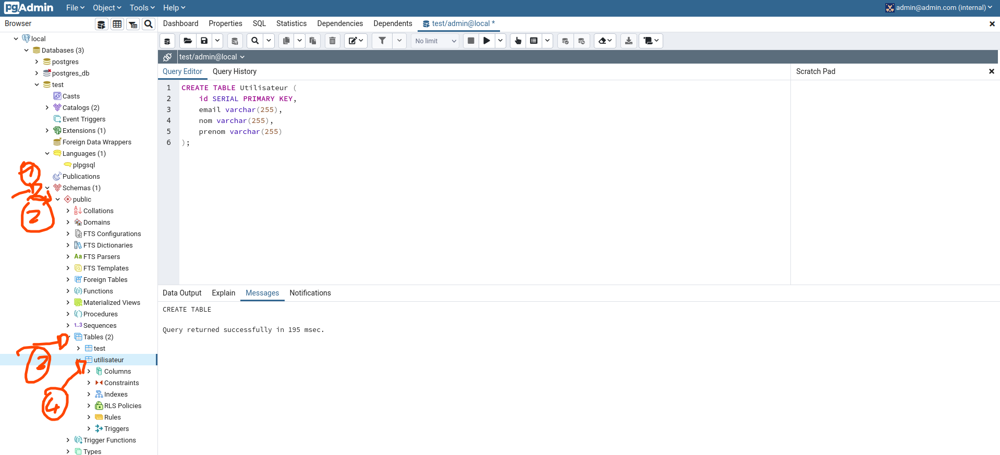

# Le SQL

Le SQL est un langage semantic permettant d'interargir avec une base de données.

Chaque instructions est ce qu'on appel une requête.

## Création de table

Il est possible d'utiliser le langage SQL afin de créer des tables :


Exemple :



[Documentation de `CREATE TABLE`](https://www.tutorialspoint.com/postgresql/postgresql_create_table.htm)

## Insérer des lignes dans une table

Pour insérer de nouvelles lignes dans une table il faut utiliser l'instruction : [`INSERT INTO`](https://www.tutorialspoint.com/postgresql/postgresql_insert_query.htm)
:

```sql
INSERT INTO Utilisateur (email, nom, prenom)
VALUES ('john@mail.com', 'doe', 'john');
```

Cette commande permet d'ajouter une nouvelle ligne dans la table Utilisateur.

> On spécifie jamais la clefs primaire dans un insert into. C'est la base de données qui s'occupe de générer une clefs primaire.

## Récupérer des lignes d'une table

Pour récupérer des lignes d'une base de données, il faut utiliser l'instruction [`SELECT`](https://www.tutorialspoint.com/postgresql/postgresql_select_query.htm)

Exemples :

```sql
SELECT id, email FROM Utilisateur;
```

> Pour séléctionner des résultats on spécifie d'abord les colones que l'on veut séléctionner et ensuite la table
> On peut aussi séléctionner toutes les colones

```sql
SELECT * FROM Utilisateur;
```

## Modifier une ligne d'une table

Pour modifier une ligne d'une table en utilisant SQL, il faut utiliser l'instruction : [`UPDATE`](https://www.tutorialspoint.com/postgresql/postgresql_update_query.htm)

Cette intruction est un peu particulière car elle peut modifier 1 ou plusieurs lignes de notre base de données en une fois !

Ce update utilise des conditions. Pour faire une condition en SQL il faut utiliser l'instuction : [`WHERE`](https://www.tutorialspoint.com/postgresql/postgresql_where_clause.htm)

Exemple :

```sql
UPDATE Utilisateur
SET nom = 'Dupont', prenom = 'Jean'
WHERE id = 1;
```

## Supprimer des lignes de la base de données

Pour supprimer des lignes d'une table de notre base de données il faut utiliser l'instruction : [`DELETE`](https://www.tutorialspoint.com/postgresql/postgresql_delete_query.htm)

Cette instruction fonctionne de la même manière que le `UPDATE` :

```sql
DELETE FROM Utilisateur
WHERE id = 1;
```

> **Entrainez-vous** : SQL n'est pas un langage compliqué, il faut absolument maîtriser les bases car il devient très très vite complexe !

## Les conditions avec `WHERE`

L'instruction `WHERE` permet de lancer tout un tas de condition à notre requête.

On peu l'utiliser dans une instruction `UPDATE`, `DELETE` mais aussi dans un `SELECT` !

Exemple :

```sql
SELECT *
FROM users
WHERE nom = "doe";
```

### Les opérateurs de comparaison

Il est possible d'utiliser les opérateur suivant pour comparer vos données dans une instruction `WHERE` :

| operateur | signification      |
| --------- | ------------------ |
| =         | est égale à        |
| !=        | n'est pas égale à  |
| >         | supérieur à        |
| <         | inférieur à        |
| >=        | supérieur ou égale |
| <=        | inférieur ou égale |

### L'opérateur de recherche textuelle

Il est possible de rechercher dans du text très simplement avec un opérateur : `LIKE`

> Cette opérateur est très puissant, mais pas forcèment très performant ... Essayer de limiter son utilisation.
> Pour l'utiliser il suffit de lui spécifier le text recherché, le character `%` permet de dire `n'importe quoi` :

Exemple :

```sql
SELECT * FROM users
WHERE firstname LIKE '%ne';
```

> Séléctionne tout les users dont le firstname **termine par `ne`**

```sql
SELECT * FROM users
WHERE firstname LIKE 'ja%';
```

> Séléctionne tout les users dont le firstname **commence par `ja`**

```sql
SELECT * FROM users
WHERE firstname LIKE '%o%';
```

> Séléctionne tout les users dont le firstname **qui contient `o`**

### Les opérateur logique

Il est aussi de combiner plusieurs conditions en utilisant les opérateur logique suivant :

| opérateur | signification |
| --------- | ------------- |
| AND       | et            |
| OR        | ou            |

> Les parenthèse sont utilisé pour créer des priorités (comme en mathématique)
> Exemple :

```sql
SELECT *
FROM shoes
WHERE price >= 100 OR (
    price <= 50
    AND
    size = '34'
);
```

> Séléctionne toutes les chaussure dont le price est supérieur ou égale à 100 ou bien à la fois le price inférieur ou égale à 50 et la size égale à 34

## Les relations

L'intéret principal des base de données SQL (relationnel) est de pouvoir réaliser des relations entre nos tables.

Il éxiste que 3 sortes de relations entre les tables de réalisable :

- **OneToOne** : Un ligne reliée à une autre ligne d'un autre table
- **OneToMany / ManyToOne** : une ligne relié à plusieurs ligne d'une autre table
- **ManyToMany** : plusieurs ligne relié à plusieurs ligne d'une autre table

Exemple :

- Un utilisateur possède une addresse et une addresse possède un utilisateur : C'est donc une `OneToOne` !

- Un utilisateur qui possède plusieurs adresses et une address qui possède un seul utilisateur : C'est donc une `OneToMany`

## La relations `OneToOne`

Nous voulons attaché un utilisateur à une addresse et une address à un utilisateur.

Pour cela nous allons utilisé un couple de clefs étrangère :

- La table user possèdera une colonne (ex: `addressId`) faisant référence à son adresse associé
- De la même manière la table `addresses` doit elle aussi possèder une colone (ex: `userId`) faisant référence à son utilisateur

Pour réaliser une relation `OneToOne` il faut donc 2 clefs étrangére, une sur chaqute table :

### Ajouter une clefs etrangère avec `ALTER TABLE`

L'instruction `ALTER TABLE` permet de modifier la structure d'une table. Pour ajouter une clefs étrangére il faut utiliser la contrainte `REFERENCE` :

```sql
ALTER TABLE users
ADD addressId INT NOT NULL REFERENCES addresses(id);
```

```sql
ALTER TABLE addresses
ADD userId INT NOT NULL REFERENCES users(id);
```

## Les relation `ManyToOne` / `OneToMany`

Pour cela, c'est encore plus simple.

Prenons un exemple :

> Un utilisateur peut avoir plusieurs adresse
>
> Une addresse ne peut avoir qu'un seul utilisateur
> Il suffit de rajouter du côté de la relation « unique » (addresse), une clefs étrangère :

```sql
ALTER TABLE addresses
ADD userId INT NOT NULL REFERENCES users(id);
```

## Les relations `ManyToMany`

Ces relations son plus complexe. Elle doivent pour se mettre en place créer leurs propres table, qu'on appel : **table de jointure**

> Un utilisateur peut avoir plusieurs addresses
>
> Une adresse peut avoir plusieurs utilisateur
> Création d'un table de jointure :

```sql
CREATE TABLE users_addresses (
    userId INT NOT NULL REFERENCES users(id),
    addressId INT NOT NULL REFERENCES addresses(id),
);
```
