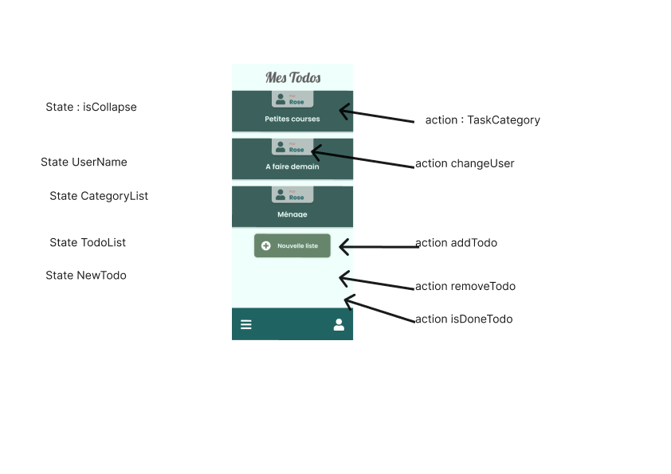
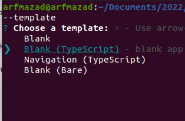
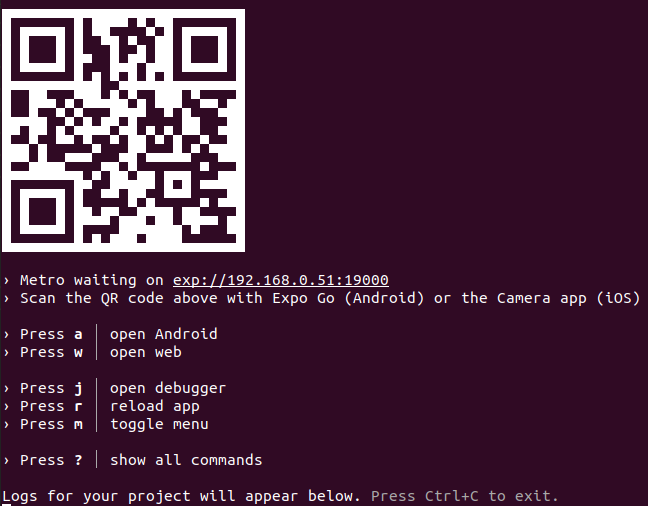
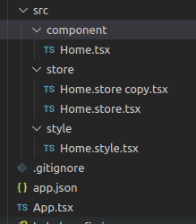

# todolist version mobile

## schema réactif



## préparation de l'environnement

télécharcher l'appli (expo go) pour voir les dev sur le téléphone:

- Android : [Expo Go](https://play.google.com/store/apps/details?id=host.exp.exponent&gl=US)
- Apple : [Expo Go](https://apps.apple.com/us/app/expo-go/id982107779)

?? quid du débuggage ?

### creation du projet

```bash
npx create-expo-app nonDuProjetAMettreIci --template
```

choisir les option Blank(typescript)



pour démarrer l'application

```bash
npm start
```



scanner le qrcode pour lancer l'application coté téléphone : application expo-go

## Installation des packages complémentaire

attention il y a des package spécifique pour mobile qui sont différent de browser web

### styled component

```bash
npm i styled-components
npm i -D @types/styled-components @types/styled-components-react-native
```

### font (exemple lobster)

```bash
npx expo install expo-font @expo-google-fonts/lobster
```

### icone (fontawesome)

```bash
npm i @expo/vector-icons
```

### native router

```bash
npm i react-router-native
```

#nanostore

```bash
$ npm i nanostores @nanostores/react

```

## arborescence projet


App.tsx(mobile) renplace main.tsx(browser)
