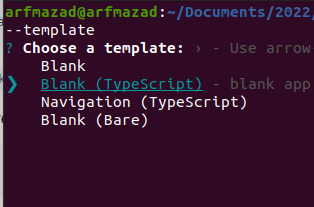
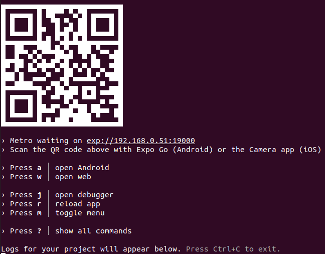

# cheatsheet mobil

pour les récepteurs (téléphone) :

- Android : [Expo Go](https://play.google.com/store/apps/details?id=host.exp.exponent&gl=US)
- Apple : [Expo Go](https://apps.apple.com/us/app/expo-go/id982107779)

création de l'application

```bash
npx create-expo-app 04_todomobil --template
```

choisir blank (typescript)


```bash
cd 04_todomobil
npm run android
npm run ios
npm run web
```

```bash
npm start
```



scanner le qrcode pour lancer l'application coté téléphone : application expo-go

installer styled component

```bash
npm i styled-components
npm i -D @types/styled-components @types/styled-components-react-native
```

npm install styled-components --save

install font lobster

```bash
npx expo install expo-font @expo-google-fonts/lobster
```

regarder dans package.json la font inporter

icones
install Icones

```bash
npm i @expo/vector-icons
```

native router
install Icones

```bash
npm i react-router-native

```
