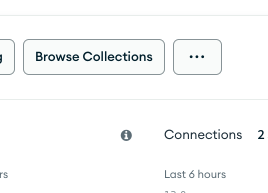

# MongoDB atlas

[site mongo db](https://cloud.mongodb.com/)

permet de voir les données de la base.

[MongoDbsh](https://www.mongodb.com/try/download/shell) permet de requetter la base mongodb

[mongodb university](https://www.mongodb.com/try/download/shell)

